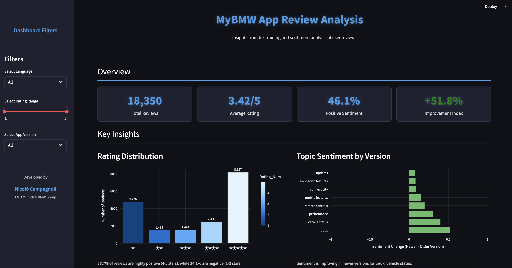

# BMW App Review Analysis

A comprehensive system for analyzing and visualizing user reviews of the MyBMW app using AI-powered text mining and sentiment analysis.


*The MyBMW app on Google Play Store, the source of reviews analyzed in this project.*

## Overview

This project analyzes BMW app reviews to extract actionable insights through advanced text classification and visualization. It processes user feedback through multiple classification dimensions to identify patterns, issues, and opportunities for improvement in the MyBMW app experience.

## Components

This project consists of two main components:

1. **Classification Engine** (`classification.py`): Processes app reviews through multiple AI-powered classification dimensions using Ollama's Gemma 3:12b model.

2. **Interactive Dashboard** (`dashboard.py`): A Streamlit-based visualization interface that presents the analysis results in an interactive, filterable dashboard.

## Features

### Classification Capabilities
- **Sentiment Analysis**: Categorizes reviews as positive, negative, or neutral
- **Topic Identification**: Tags reviews with relevant topics (UI/UX, performance, connectivity, etc.)
- **Vehicle Type Detection**: Identifies if the review relates to electric/hybrid or combustion vehicles
- **User Experience Classification**: Determines if the user is new or experienced
- **Usage Profile Analysis**: Classifies users as power users or casual users
- **Pain Point Detection**: Identifies reviews mentioning specific problems
- **Feature Request Identification**: Detects when users are requesting new features
- **Competitor Analysis**: Extracts mentions of competing car brands

### Dashboard Visualizations
- Rating distribution and sentiment breakdown
- Topic prevalence and sentiment by topic
- Sentiment trends across app versions
- Language-specific analysis
- Competitor mention analysis
- Feature request insights
- Exportable filtered data

## Installation

```bash
# Clone the repository
git clone https://github.com/yourusername/bmw-app-analysis.git
cd bmw-app-analysis

# Install dependencies
pip install -r requirements.txt

# Install Ollama (required for classification)
# Follow instructions at https://ollama.ai/

# Pull the Gemma model
ollama pull gemma3:12b
```

## Usage

### Running the Classification

```bash
# Process reviews through the classification engine
python classification.py
```

The classification script:
- Processes reviews in configurable batch sizes
- Supports resuming from previous runs
- Creates checkpoints for resilience
- Generates consolidated results in CSV format


*Example output: Detailed topic-specific analysis showing sentiment breakdowns, issues, and feature requests for authentication.*

### Launching the Dashboard

```bash
# Start the Streamlit dashboard
streamlit run dashboard.py
```

The dashboard provides:
- Interactive filtering by date, language, rating, and app version
- Multiple visualizations across different dimensions
- Exportable filtered data
- Actionable insights based on the analysis


*The interactive Streamlit dashboard showing sentiment analysis, rating distribution, and topic trends across app versions.*

## Project Structure

```
bmw_app_analysis/
├── checkpoints/        # Incremental processing checkpoints
├── results/            # Final analysis results
├── logs/               # Processing logs
├── translations/       # Contains translated reviews
├── images/             # Screenshots and visualizations
├── classification.py   # Classification engine
├── dashboard.py        # Streamlit visualization dashboard
└── requirements.txt    # Project dependencies
```

## Technologies

- Python 3.8+
- Ollama with Gemma 3:12b model for text classification
- Pandas for data processing
- Streamlit for interactive dashboard
- Plotly for data visualization
- tqdm for progress tracking

## Academic Context

This project was developed as part of a university project at Ludwig Maximilian University of Munich (LMU) in collaboration with BMW Group. It represents an academic exploration of applied AI and text mining techniques to improve customer experience insights for automotive applications.